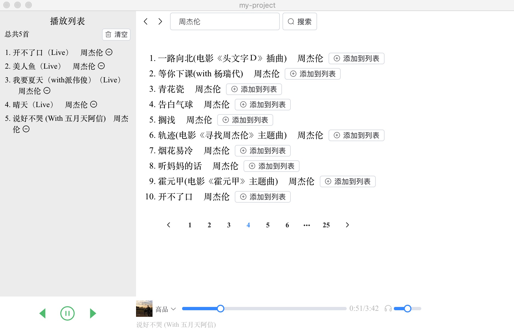
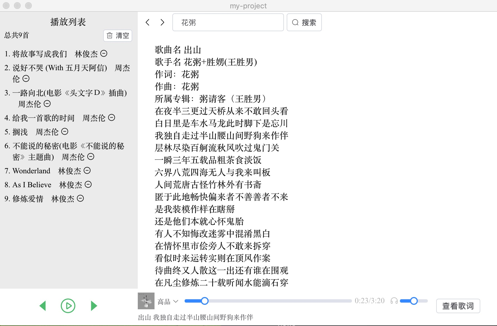

# electron-vue-music

mac 版<a href="https://github.com/buppt/electron-vue-music/releases/download/v0.0.2/music-player-0.0.1.dmg">下载地址</a>，然后就可以愉快的听杰伦了。




## 完成进度

- [ ] 界面美化
- [x] 歌曲搜索
- [x] 点击歌曲名播放音乐
- [x] audio 显示与控制部分
- [ ] 对播放过的音乐进行缓存
- [x] 播放列表，点击“添加到列表”添加歌曲，点击减号删除歌曲，清空列表。
- [x] 点击播放列表中的歌曲，列表顺序播放
- [ ] 单曲循环、列表循环、随机播放
- [x] 搜索内容前进后退
- [x] 查看歌曲歌词
- [ ] 歌词滚动
- [ ] 歌单
- [ ] 排行榜
- [ ] 专辑
- [ ] 搜索提示
- [ ] 搜索热词
- [ ] 歌手详情页

### Build Setup

```bash
# install dependencies
yarn

# serve with hot reload at localhost:9080
yarn dev

# build electron application for production
yarn build
```
